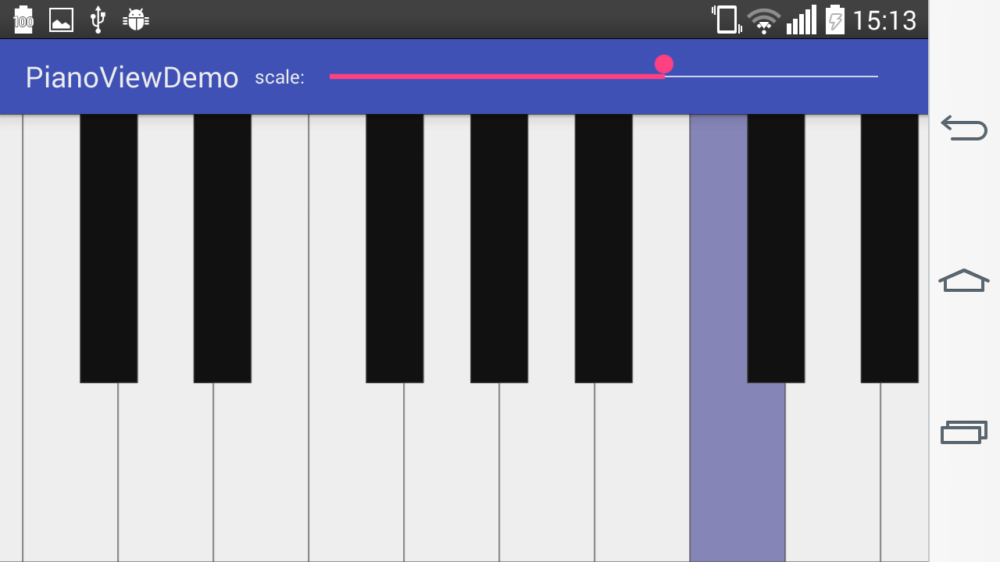

# piano-view

## Screenshot

## Quick start
- just put the `PianoView` to an activity to see it in action
- use `PianoView.setTouchEventListener(PianoViewTouchEventListener listener)` to get touch events
- see `app/` for demo
- see `pianoviewlib/` for the actual library module

## License
- Apache License, Version 2.0

## Features
- zoomable (while key width = 100px when scale = 1, see `PianoView.setScale(float scale)`)
- scrollable (see `PianoView.setPosition(float position)`)
- view easily extend-able to draw additional info
- simulated midi velocity by y-axis value of touch pointers

## TODO List
- expose styling params
- overload setPosition to accept midi note as param
